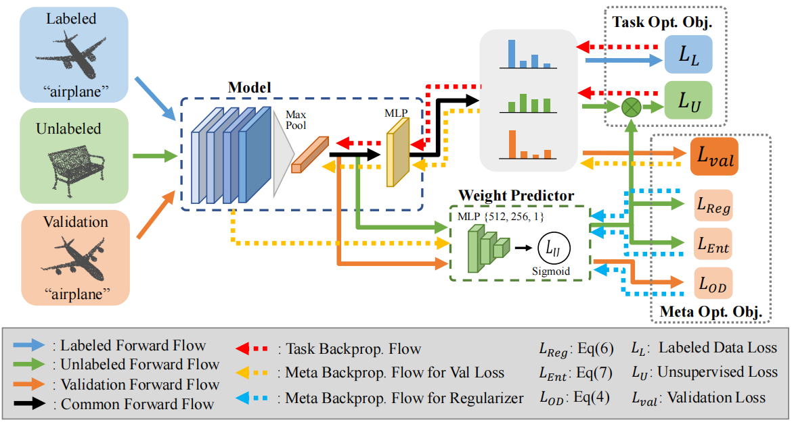

## Open-Set-Semi-Supervised-Learning-for-3D-Point-Cloud-Understanding
Created by <a href="https://github.com/SBXGary" target="_blank">Xian Shi</a> from South China University of Technology.

### Introduction
This work is based on our ICPR2022 paper <a href="https://arxiv.org/abs/2205.01006">Open-Set-Semi-Supervised-Learning-for-3D-Point-Cloud-Understanding</a>. 

To reduce the dependence of point cloud semantic understanding on massively annotated data, the research interest of point cloud semi-supervised learning (SSL) is emerging. It is commonly assumed in SSL that the unlabeled data are drawn from the same distribution as that of the labeled ones; This assumption, however, rarely holds true in realistic environments. Blindly using out-of-distribution (OOD) unlabeled data could harm SSL performance. In this work, we propose to selectively utilize unlabeled data through sample weighting, so that only conducive unlabeled data would be prioritized. To estimate the weights, we adopt a bi-level optimization framework which iteratively optimizes a meta-objective on a held-out validation set and a task-objective on a training set. In addition, three regularization techniques are applied to enhance the stability of the optimization. Extensive experiments on 3D point cloud classification and segmentation tasks verify the effectiveness of our proposed method. 

Here we release python code for experiments on ModelNet40 [1] and ShapeNet [2] and you are welcome to report any bugs you would identify. Should you have any concerns or experience any issues please raise in Issues so that all people can benefit from the discussions.

### Citation
Please cite the following work if you feel it is helpful.

@article{shi2022open,
  title={Open-Set Semi-Supervised Learning for 3D Point Cloud Understanding},
  author={Shi, Xian and Xu, Xun and Zhang, Wanyue and Zhu, Xiatian and Foo, Chuan Sheng and Jia, Kui},
  journal={arXiv preprint arXiv:2205.01006},
  year={2022}
}

### Installation
This code has been tested on Pyhon3.8, CUDA 11.0, cuDNN 9.2 and Ubuntu 20.04

### Backbone
<a href="https://github.com/muhanzhang/pytorch_DGCNN">DGCNN</a> is used as the backbone network in both point cloud classification and semantic segmentation tasks.

### Usage
(1) OpenSet semi-supervised training with fixmatch stategy

	### classification / part segmentation
	python train_cls_fixmatch.py / train_seg_fixmatch.py
	
(2) OpenSet semi-supervised training with our ReBO method

	### classification / part segmentation
	python train_cls_rebo.py / train_seg_rebo.py
	

Reference:

[1] Zhirong Wu, Shuran Song, Aditya Khosla, Fisher Yu, Linguang Zhang, Xiaoou Tang, and Jianxiong Xiao. 3d shapenets: A deep representation for volumetric shapes.

[2] Li Yi, Vladimir G Kim, Duygu Ceylan, I Shen, Mengyan Yan, Hao Su, Cewu Lu, Qixing Huang, Alla Sheffer, Leonidas Guibas, et al. A scalable active framework for region annotation in 3d shape collections. ACM Transactions on Graphics, 2016.

